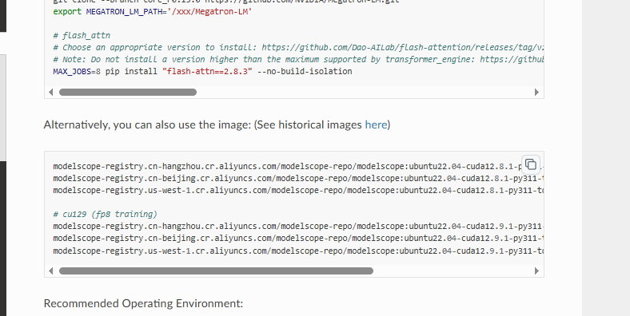
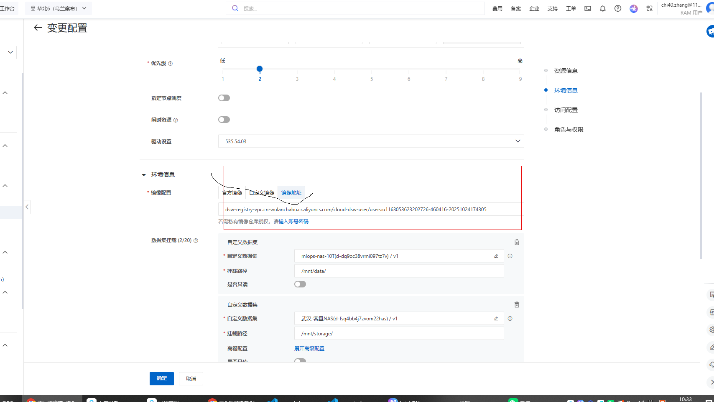

# how to run ms-swift + megatron to train model
## environmental preparation、
### plan 1：use existed docker image 
   1. pull the image from registry 
    - all images could be downloaded from official documnet of ms-swift:
    [repository of ms-swift： https://github.com/modelscope/ms-swift](https://swift.readthedocs.io/en/latest/Megatron-SWIFT/Quick-start.html)
    - find the official docker and choose any of the directory of the docker
    
    **note**: The reason why we use docker is that it is the most simple and efficient way to build enviornment, which need to be consistent across all the distributed nodes. if you want to manually install the environment without docker, please refer to the official document of ms-swift: [link](https://swift.readthedocs.io/en/latest/Megatron-SWIFT/Quick-start.html) 
    but in my opinion, it is not recommended to manually install the environment, because it is very easy to make mistakes and hard to debug. a slight mistake may lead to failure of the whole training, especially when you want to use multiple nodes to train the model with ms-swift + megatron.
    2. run the docker image on Aliyun ECS instance:
    - open aliyun terminal and input the url of the docker image on `customized image` field to change the image of the instance.
    
    - after the instance is started, the system environment for ms-swift + megatron is ready to use. we can directly run the training script for distributed training
## Distributed Training
### plan 1: prepare the model format for distributed training 
1. we should understand that there are two types of model format in ms-swift:
    - the first kind of data format is the huggingface model format, which is the most common format for pre-trained models. the model files are usually stored in a directory with the following structure:
    ```
    model_name/
        config.json
        pytorch_model.bin
        tokenizer_config.json
        vocab.txt
        xxx.safetensors
    ```
    - the second kind of data format is the megatron model format which is used for distributed training with megatron. the model files are usually stored in a directory with the following structure:
    ```
    model_name/
        mp_rank_00/
            model_00_00.bin
            model_00_01.bin
            ...
        mp_rank_01/
            model_01_00.bin
            model_01_01.bin
            ...
        ...
    ```
if you want to use distiributed training backend to run pipeline parallelism, tensor parallelism, expert parallelism, you should convert the huggingface model format to megatron model format.
but if you only want to use data parallelism, you can directly use the huggingface model format without conversion. 
**notice**： deepspeed zero 1/2/3 and fsdp are all data parallelism backends. if you find that if we split model with deepspeed/fsdp on single node, it is not necessary to run other parallelism backends like tensor parallelism, pipeline parallelism. because deepspeed/fsdp can split the model automatically on single node. and the performance is also good enough with less communication cost. so if you want to use deepspeed/fsdp, you can directly use huggingface model format without conversion.
However，if you are training a moe model, expert parallelism is strongly recommended to reduce GPU bubble time. in this case, you should convert the huggingface model format to megatron model format.
2. convert the model format from huggingface to megatron and convert it back to huggingface after training
- to convert the model format from huggingface to megatron, you can use the following script
```bash
#!/usr/bin/env bash
set -e

swift export \
    --model /mnt/storage/models/OpenGVLab/InternVL3_5-241B-A28B \
    --to_mcore true \
    --torch_dtype bfloat16 \
    --output_dir /mnt/storage/MLLM/zc/megatron_output/InternVL3_5-241B-A28B
```
- convert megatron model format back to huggingface format after training
```bash
swift export \
    --mcore_model megatron_output/Qwen2.5-7B-Instruct/vx-xxx/checkpoint-xxx \
    --to_hf true \
    --torch_dtype bfloat16 \
    --output_dir megatron_output/Qwen2.5-7B-Instruct/vx-xxx/checkpoint-xxx-hf \
    --test_convert_precision true
```
*Notice*: when you train with lora, the format conversion steps is slightly difference, after training, the megatron stored is lora weights, firstly we need to convert lora adapter and merge it wiht original model weights and then we can use export the trained hf format with the following script:
```bash
# megatron export
NPROC_PER_NODE=2 \
CUDA_VISIBLE_DEVICES=0,1 \
megatron export \
    --adapter_load megatron_output/Qwen2.5-7B-Instruct/vx-xxx/checkpoint-xxx \
    --to_hf true \
    --tensor_model_parallel_size 2 \
    --merge_lora false \
    --torch_dtype bfloat16 \
    --save megatron_output/Qwen2.5-7B-Instruct/vx-xxx/checkpoint-xxx-hf \
    --test_convert_precision true 
    # test_convert_precision is optional, test the converted model precision, if the export time is too long, you can remove this flag

# swift export
# CUDA_VISIBLE_DEVICES=0 \
# swift export \
#     --mcore_adapters megatron_output/Qwen2.5-7B-Instruct/vx-xxx/checkpoint-xxx \
#     --to_hf true \
#     --torch_dtype bfloat16 \
#     --output_dir megatron_output/Qwen2.5-7B-Instruct/vx-xxx/checkpoint-xxx-hf \
#     --test_convert_precision true
```

### plan 2: run distributed training with ms-swift + megatron
After the training format is prepared, we can directly run the distributed training with ms-swift + megatron, and here is an example of training script

#### Train in DeepSpeed/FSDP backend (without model format conversion)
```bash
# use device_map
# 8 * 70GiB
IMAGE_MAX_TOKEN_NUM=1024 \
CUDA_VISIBLE_DEVICES=0,1,2,3,4,5,6,7 \
swift sft \
    --model /mnt/storage/models/Qwen3/Qwen3_VL235B-thinking \
    --dataset '/mnt/workspace/MLLM/zc/tclreasoning/data_pipeline/DataFiltering/batch_inferenceApi/data/question_sample_with_embedding_selection_add_78version.json' \
    --load_from_cache_file true \
    --split_dataset_ratio 0.01 \
    --train_type lora \
    --torch_dtype bfloat16 \
    --num_train_epochs 1 \
    --per_device_train_batch_size 2 \
    --per_device_eval_batch_size 4 \
    --attn_impl flash_attn \
    --padding_free true \
    --learning_rate 1e-4 \
    --lora_rank 128 \
    --lora_alpha 32 \
    --target_modules all-linear \
    --router_aux_loss_coef 1e-3 \
    --freeze_vit true \
    --freeze_aligner true \
    --gradient_accumulation_steps 4 \
    --gradient_checkpointing true \
    --eval_steps 50 \
    --save_steps 5 \
    --save_total_limit 2 \
    --logging_steps 5 \
    --max_length 8192 \
    --output_dir /mnt/storage/MLLM/zc/qwen3_Vloutput_doubao_vqa_20k_1020 \
    --warmup_ratio 0.05 \
    --dataset_num_proc 4 \
    --dataloader_num_workers 4 \
    --strict False
```
Here is the table for parameters explanation:
| Parameter                         | Explanation                                                  |
|-----------------------------------|--------------------------------------------------------------|
| IMAGE_MAX_TOKEN_NUM               | Maximum number of tokens for image input                     |
| CUDA_VISIBLE_DEVICES              | Specify which GPUs to use for training                       |
| swift sft                         | Command to start supervised fine-tuning with Swift          |
| --model                           | Path to the pre-trained model                                |
| --dataset                         | Path to the training dataset                                 |
| --load_from_cache_file            | Whether to load dataset from cache                            |
| --split_dataset_ratio             | Ratio to split the dataset for validation                    |
| --train_type                      | Type of training (e.g., lora)                                |
| --torch_dtype                     | Data type for training (e.g., bfloat16)                           |
| --num_train_epochs                | Number of training epochs                                    |
| --per_device_train_batch_size     | Batch size per device for training                           |
| --per_device_eval_batch_size      | Batch size per device for evaluation                          |
| --attn_impl                       | Attention implementation to use (e.g., flash_attn)                     |
| --padding_free                    | Whether to use padding-free attention                        |
| --learning_rate                   | Learning rate for training                                   |
| --lora_rank                       | Rank for LoRA                                               |
| --lora_alpha                      | Alpha value for LoRA                                        |
| --target_modules                 | Target modules for LoRA adaptation                          |
| --router_aux_loss_coef            | Coefficient for router auxiliary loss                        |
| --freeze_vit                      | Whether to freeze the vision transformer                     |
| --freeze_aligner                 | Whether to freeze the aligner                                |
| --gradient_accumulation_steps     | Number of gradient accumulation steps                        |
| --gradient_checkpointing          | Whether to use gradient checkpointing                        |
| --eval_steps                      | Number of steps between evaluations                          |
| --save_steps                      | Number of steps between model savings                        |
| --save_total_limit                | Maximum number of saved models to keep                       |
| --logging_steps                   | Number of steps between logging                              |
| --max_length                      | Maximum sequence length                                     |
| --output_dir                      | Directory to save the trained model                          |
| --warmup_ratio                    | Ratio of warmup steps                                       |
| --dataset_num_proc                | Number of processes for dataset loading                      |
| --dataloader_num_workers         | Number of workers for data loading                           |
| --strict                          | Whether to enforce strict parameter matching                 |
#### Train in Megatron backend (with model format conversion)
```bash
# 8 * 70GiB

PYTORCH_CUDA_ALLOC_CONF='expandable_segments:True' \
IMAGE_MAX_TOKEN_NUM=4096 \
CUDA_VISIBLE_DEVICES=0,1,2,3,4,5,6,7 \
nnodes=2
nproc_per_node=8
NNODES=$nnodes \
NODE_RANK=0 \
MASTER_ADDR=10.10.9.97 \
MASTER_PORT=29500 \
NPROC_PER_NODE=$nproc_per_node \
megatron sft \
    --load /mnt/storage/MLLM/zc/megatron_output/Qwen3_VL235B-thinking/v3-20250919-184145-mcore \
    --dataset '/mnt/workspace/MLLM/zc/zyf/doubao_paper_vqa_2.1w_sft.json' \
    --load_from_cache_file true \
    --split_dataset_ratio 0.01 \
    --train_type lora \
    --lora_rank 128 \
    --lora_alpha 32 \
    --target_modules all-linear \
    --moe_permute_fusion true \
    --pipeline_model_parallel_size 2 \
    --tensor_model_parallel_size 4 \
    --expert_tensor_parallel_size 1 \
    --expert_model_parallel_size 8 \
    --moe_grouped_gemm true \
    --moe_shared_expert_overlap true \
    --moe_aux_loss_coeff 1e-6 \
    --micro_batch_size 1 \
    --global_batch_size 128 \
    --recompute_granularity full \
    --recompute_method uniform \
    --recompute_num_layers 1 \
    --max_epochs 1 \
    --finetune true \
    --cross_entropy_loss_fusion true \
    --lr 1e-4 \
    --lr_warmup_fraction 0.05 \
    --min_lr 1e-5 \
    --save /mnt/storage/MLLM/zc/megatron_output/Qwen3-VL-235B-A22B-Thinking_新版豆包数据直接蒸馏-切片融合_1025 \
    --eval_interval 200 \
    --save_interval 5 \
    --max_length 6400 \
    --packing true \
    --num_workers 8 \
    --dataset_num_proc 8 \
    --no_save_optim true \
    --no_save_rng true \
    --sequence_parallel true \
    --attention_backend flash

```
Here is the table for parameters explanation:
| Parameter                         | Explanation                                                  |
|-----------------------------------|--------------------------------------------------------------|
| PYTORCH_CUDA_ALLOC_CONF           | Configuration for CUDA memory allocation                     |
| IMAGE_MAX_TOKEN_NUM               | Maximum number of tokens for image input                     |
| CUDA_VISIBLE_DEVICES              | Specify which GPUs to use for training                       |
| nnodes                            | Number of nodes for distributed training                     |
| nproc_per_node                    | Number of processes per node                                 |
| NNODES                            | Environment variable for number of nodes                     |
| NODE_RANK                         | Environment variable for node rank                           |
| MASTER_ADDR                       | Environment variable for master node address                 |
| MASTER_PORT                       | Environment variable for master node port                    |
| NPROC_PER_NODE                    | Environment variable for number of processes per node        |
| megatron sft                      | Command to start supervised fine-tuning with Megatron       |
| --load                            | Path to the pre-trained model in megatron format             |
| --dataset                         | Path to the training dataset                                 |
| --load_from_cache_file            | Whether to load dataset from cache                            |
| --split_dataset_ratio             | Ratio to split the dataset for validation                    |
| --train_type                      | Type of training (e.g., lora)                                |
| --lora_rank                       | Rank for LoRA                                               |
| --lora_alpha                      | Alpha value for LoRA                                        |
| --target_modules                 | Target modules for LoRA adaptation                          |
| --moe_permute_fusion              | Whether to use MoE permute fusion                              |
| --pipeline_model_parallel_size    | Size of pipeline model parallelism                           |
| --tensor_model_parallel_size      | Size of tensor model parallelism                             |
| --expert_tensor_parallel_size     | Size of expert tensor parallelism                            |
| --expert_model_parallel_size      | Size of expert model parallelism                             |
| --moe_grouped_gemm                | Whether to use MoE grouped moe_grouped_gemm gemm                          |
| --moe_shared_expert_overlap       | Whether to use MoE shared expert overlap                           |
| --moe_aux_loss_coeff              | Coefficient for MoE auxiliary loss                           |
| --micro_batch_size                | Micro batch size for training                                |        
| --global_batch_size               | Global batch size for training                               |
| --recompute_granularity           | Granularity for recompute                                   |
| --recompute_method                | Method for recompute                                        |
| --recompute_num_layers            | Number of layers for recompute                               |
| --max_epochs                      | Maximum number of training epochs                            |
| --finetune                        | Whether to finetune the model                                |
| --cross_entropy_loss_fusion       | Whether to use cross-entropy loss fusion                     |
| --lr                              | Learning rate for training                                   |
| --lr_warmup_fraction              | Fraction of warmup steps for learning rate                   |
| --min_lr                          | Minimum learning rate                                       |
| --save                            | Directory to save the trained model                          |
| --eval_interval                   | Interval for evaluation steps                                |
| --save_interval                   | Interval for model saving steps                              |
| --max_length                      | Maximum sequence length                                     |
| --packing                         | Whether to use packing                                      |
| --num_workers                     | Number of workers for data loading                           |
| --dataset_num_proc                | Number of processes for dataset loading                      |        
| --no_save_optim                   | Whether to not save optimizer state                          |
| --no_save_rng                     | Whether to not save RNG state                                |
| --sequence_parallel               | Whether to use sequence parallelism                          |
| --attention_backend               | Attention backend to use (e.g., flash)                      | 

# how to calculate the final data parallel size given sequence parallel size, tensor parallel size, pipeline parallel size, expert parallel size
The final data parallel size can be calculated using the following formula:
```
data_parallel_size = total_number_of_gpus / (sequence_parallel_size * tensor_parallel_size * pipeline_parallel_size * expert_parallel_size)
```
Where:
- `total_number_of_gpus` is the total number of GPUs available for training.
- `sequence_parallel_size` is the size of sequence parallelism.
- `tensor_parallel_size` is the size of tensor parallelism.
- `pipeline_parallel_size` is the size of pipeline parallelism.
- `expert_parallel_size` is the size of expert parallelism.
For example, if you have a total of 64 GPUs and you are using a sequence parallel size of 2, tensor parallel size of 4, pipeline parallel size of 2, and expert parallel size of 2, the calculation would be as follows:
```
data_parallel_size = 64 / (2 * 4 * 2 * 2)
data_parallel_size = 64 / 32
data_parallel_size = 2
```Therefore, the final data parallel size would be 2.
# why the data parapllel size does matter 
The data parallel size matters for several reasons:
1. **Scalability**: A larger data parallel size allows for better scalability of the training process. It enables the model to be trained on larger datasets by distributing the data across multiple GPUs. This is particularly important for training large models that require significant computational resources.
2. **Efficiency**: By increasing the data parallel size, the workload is distributed more evenly across the available GPUs. This can lead to improved efficiency and reduced training time, as each GPU can process a smaller portion of the data in parallel.
3. **Memory Utilization**: A larger data parallel size can help optimize
    memory utilization across GPUs. Each GPU can store a smaller portion of the model and data, allowing for larger models to be trained without exceeding the memory limits of individual GPUs.
4. **Reduced Communication Overhead**: With a larger data parallel size, the communication overhead between GPUs can be reduced. This is because each GPU processes a smaller portion of the data, leading to fewer synchronization points and less data transfer between GPUs.
# how gradient checkpointing save memory
the parameter ``` --gradient_checkpointing true ``` enables gradient checkpointing during training, which is a technique used to reduce memory consumption by trading off computation for memory. When gradient checkpointing is enabled, intermediate activations of the model are not stored in memory during the forward pass. Instead, they are recomputed during the backward pass when gradients are calculated. This allows for a significant reduction in memory usage, especially for large models, as it avoids storing all intermediate activations in memory. However, it does increase the computational overhead during backpropagation, as some computations need to be redone. Overall, gradient checkpointing is a useful technique for training large models on limited memory resources.