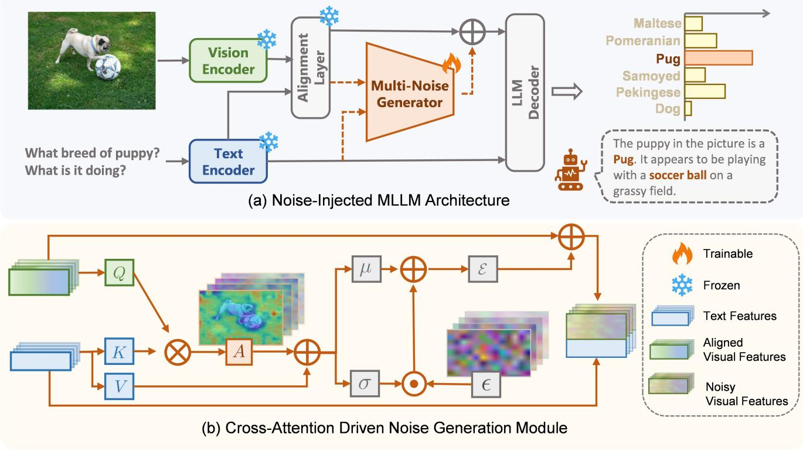
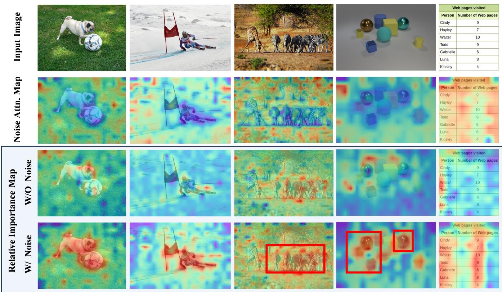
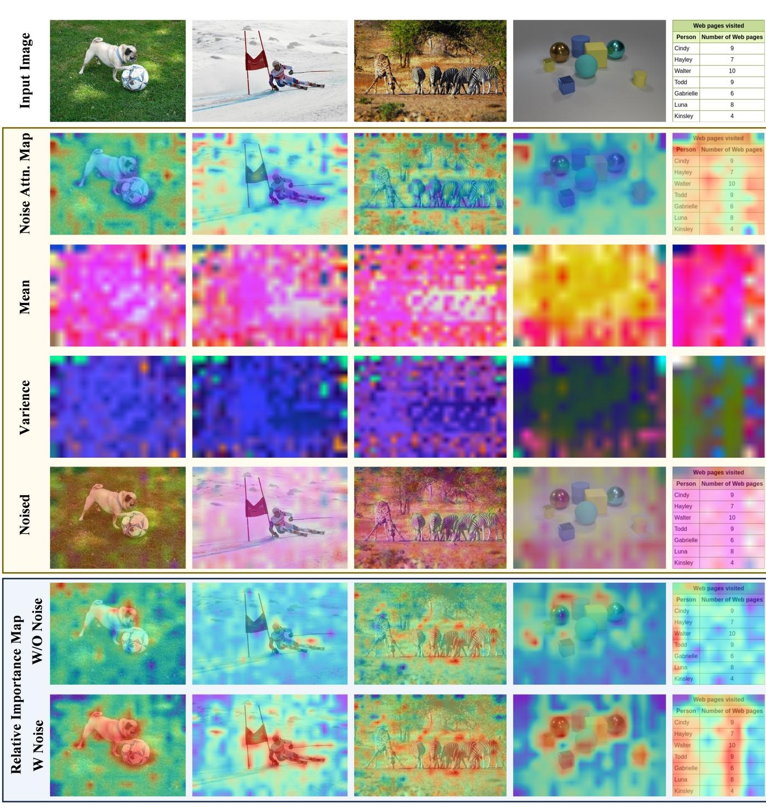

# Explore How to Inject Beneficial Noise in MLLMs

Ruishu $\mathbf { Z } \mathbf { h } \mathbf { u } ^ { 1 , 2 }$ , Sida Huang1,2, Ziheng Jiao3, Hongyuan Zhang2, 4\*

1School of Artificial Intelligence, OPtics and ElectroNics (iOPEN), Northwestern Polytechnical University 2Institute of Artificial Intelligence (TeleAI), China Telecom 3HuaWei Technologies Co., Ltd. 4The University of Hong Kong {zhuruishu0848, sidahuang2001}@gmail.com, jzh9830@163.com, hyzhang98@gmail.com

# Abstract

Multimodal Large Language Models (MLLMs) have played an increasingly important role in multimodal intelligence. However, the existing fine-tuning methods often ignore crossmodal heterogeneity, limiting their full potential. In this work, we propose a novel fine-tuning strategy by injecting beneficial random noise, which outperforms previous methods and even surpasses full fine-tuning, with minimal additional parameters. The proposed Multimodal Noise Generator (MuNG) enables efficient modality fine-tuning by injecting customized noise into the frozen MLLMs. Specifically, we reformulate the reasoning process of MLLMs from a variational inference perspective, upon which we design a multimodal noise generator that dynamically analyzes crossmodal relationships in image-text pairs to generate taskadaptive beneficial noise. Injecting this type of noise into the MLLMs effectively suppresses irrelevant semantic components, leading to significantly improved cross-modal representation alignment and enhanced performance on downstream tasks. Experiments on two mainstream MLLMs, QwenVL and LLaVA, demonstrate that our method surpasses full-parameter fine-tuning and other existing fine-tuning approaches, while requiring adjustments to only about $1 \sim 2 \%$ additional parameters. The relevant code is uploaded in the supplementary.

# Code — https://github.com/zhuruishu0848/MuNG

# 1 Introduction

In recent years, Large Language Models (LLMs) (Touvron et al. 2023; Achiam et al. 2023; Yang et al. 2024; DeepSeekAI 2025) have demonstrated impressive capabilities, successfully addressing various complex tasks. Building upon this strength, cutting-edge works such as LLaVA (Liu et al. 2023a), Qwen2.5-VL (Bai et al. 2025), and InternVL (Chen et al. 2024c) have begun exploring the synergy between vision and language modalities. Integrating vision and language allows models to transcend textual limits, gain visual understanding, and produce fluent visual descriptions. This cross-modal fusion is driving a paradigm shift in large models from single-modal understanding to multi-modal interaction, while injecting new developmental momentum into multiple AI frontiers.

However, current mainstream models still exhibit notable limitations in tasks involving spatial relationship understanding (Rahmanzadehgervi et al. 2024; Hudson and Manning 2019), hallucination suppression (Tong et al. 2024; Li et al. 2023), and over-reliance on textual information (Rahmanzadehgervi et al. 2024). To address these issues, fullparameter fine-tuning (FT) is commonly employed, which involves updating all model parameters. However, for largescale models, this approach entails substantial computational overhead and may lead to overfitting, especially when fine-tuning data is limited, thereby compromising the model-acquired general and cross-modal knowledge.

To improve efficiency, researchers initially attempted to adopt Parameter-Efficient Fine-Tuning (PEFT) (Houlsby et al. 2019) techniques from LLMs, updating or adding minimal parameters to the LLM Decoder. For example, LoRA (Hu et al. 2022) achieves substantial parameter compression through low-rank matrix injection, while Adapter employs a bottleneck structure to update only a small number of parameters. In addition, Visual Prompt Tuning (VPT) (Jia et al. 2022) approaches the problem from the visual modality perspective by introducing a small set of learnable prompts in the input space after visual embedding layers to adapt to downstream tasks. However, these fine-tuning methods remain fundamentally rooted in single-modal optimization paradigms, neglecting the need for vision-language co-optimization. Consequently, models find it difficult to efficiently adapt to the distribution shifts and alignment requirements of downstream task data. Thus, there is an urgent need to establish fine-tuning methodologies tailored to multi-modal characteristics.

In this work, we adopt a distinct approach. Instead of finetuning the LLM Decoder or unimodal Encoders, we modify the input content fed into the LLM Decoder. Motivated by the theoretical insights of positive-incentive noise (Li 2022; Zhang et al. 2025; Huang, Zhang, and Li 2025; Zhang et al. 2024; Huang et al. 2025a; Jiang et al. 2025), we present a novel, lightweight, and effective fine-tuning approach aimed at improving the multimodal understanding capabilities of MLLMs.

Our method introduces only a small set of learnable parameters during alignment to model noise distributions, while freezing the entire pretrained Encoder and Decoder backbones during training. The noise injection process enables the data to learn more generalized representations. During inference, these additional parameters are solely used to generate beneficial noise, which is added to the LLM Decoder’s input.

Our contributions can be summarized as follows:

1. We propose Multimodal Noise Generator (MuNG), the first method to leverage multimodal information for generating beneficial noise to fine-tune MLLMs. By reformulating the inference process of MLLMs from a variational inference perspective.

2. MuNG injects beneficial noise into model, effectively suppressing irrelevant semantics and enhancing coherent cross-modal representations. Our method introduces only around $1 \%$ additional parameters, enabling a highly parameter-efficient fine-tuning strategy.

3. Experiments demonstrate that our approach outperforms previous parameter-efficient methods and even matches or exceeds full fine-tuning performance across several benchmarks. Experiments validate our method’s efficiency and generalizability.

# 2 Related Work

# 2.1 Multimodal Large Language Models

In recent years, Large Language Models (LLMs) have demonstrated impressive capabilities in the text modality, successfully addressing various complex tasks. Building upon this strength, cutting-edge works such as LLaVA (Liu et al. 2023a), Qwen-VL (Bai et al. 2023), GPT-4o (Hurst et al. 2024), and InternVL (Chen et al. 2024c) have begun exploring the synergy between vision and language modalities—as the two most critical modalities in the real world, their interconnection not only enables language models to break through textual limitations and acquire visual perception abilities but also facilitates the generation of more vivid and fluent linguistic descriptions of visual scenes. This cross-modal fusion is driving a paradigm shift in large models from single-modal understanding to multi-modal interaction, while injecting new developmental momentum into multiple AI frontiers, including embodied intelligence. Meanwhile, text-to-image generation models have shown remarkable progress in visual synthesis from textual inputs (Rombach et al. 2022; Wang, Zhang, and Yuan 2025; Fu et al. 2025; Huang et al. 2025b).

# 2.2 PEFT Methods for Large Models

To reduce the computational overhead and memory footprint of fine-tuning large-scale models, various ParameterEfficient Fine-Tuning (PEFT) methods have been proposed. Among them, Adapter (Houlsby et al. 2019) , BitFit (Zaken, Ravfogel, and Goldberg 2021), and LoRA (Hu et al. 2022)have demonstrated strong empirical performance across a wide range of downstream tasks. Adapter-based methods insert small trainable modules into model layers while keeping most parameters frozen. BitFit further simplifies adaptation by tuning only bias terms, yet still achieves competitive results, particularly in text classification. LoRA introduces low-rank matrices into attention layers, significantly reducing trainable parameters without sacrificing performance. These methods reflect a growing trend: achieving high effectiveness with minimal parameter updates—ideal for resource-constrained or multi-task settings. In multimodal settings, some fusion modules—such as the Multimodal Bottleneck Transformer (MBT) (Nagrani et al. 2021), which inserts fusion bottleneck tokens to enable cross-modal interaction—can also act as efficient tuning strategies by enhancing modality integration.

# 2.3 Difference with MLLM Adversarial Attacks

Injecting adversarial noise into models is a common whitebox attack technique. Some studies have extended classical adversarial attack methods from image classification tasks—such as FGSM (Goodfellow, Shlens, and Szegedy 2014) and PGD (Madry et al. 2017)—to Multimodal Large Language Models (Zhao et al. 2023; Carlini et al. 2023; Qi et al. 2024; Wang et al. 2024a). These methods generate adversarial noise using gradient information and introduce imperceptible perturbations to the input data, thereby inducing MLLMs to produce incorrect or even unsafe outputs.In contrast, the noise introduced by our method belongs to the category of positive incentive noise. Rather than attacking the model, the goal is to simplify the task itself and guide the model toward generating more accurate outputs. This approach emphasizes enhancing model performance rather than launching untargeted attacks.

# 3 Method

# 3.1 Definition of $\pi$ -noise in Multimodal Task

Current mainstream vision-language large models typically consist of modality encoders, a multimodal fusion layer, and a LLM decoder. First, the visual and linguistic inputs, are independently processed by their respective encoders to obtain visual features and language features. These features are then integrated through a multimodal fusion layer to enable cross-modal interaction, resulting in the visual features $X _ { V }$ and language features $X _ { L }$ . And fed them into the LLM Decoder to produce the final linguistic output $A$ . According to the theory established by (Li 2022), the complexity of a VQA task can be defined as

$$
\begin{array} { l } { \displaystyle { H \left( \mathcal { T } \right) = \int _ { \mathcal { X } _ { V } } \int _ { \mathcal { X } _ { L } } p ( X _ { V } , X _ { L } ) } } \\ { \displaystyle \left( \int _ { A } - p ( A | X _ { V } , X _ { L } ) \log p ( A | X _ { V } , X _ { L } ) d A \right) d X _ { L } d X _ { V } } \\ { \displaystyle = \mathbb { E } _ { p ( A , X _ { V } , X _ { L } ) } \left[ - \log p \left( A | X _ { V } , X _ { L } \right) \right] , } \end{array}
$$

where $A$ denotes the expected linguistic output, $X _ { V }$ and $X _ { L }$ represent the input visual and language features, and $\mathcal { D } _ { X _ { V } } , \mathcal { D } _ { X _ { L } }$ are the data distributions over $X _ { V }$ and $X _ { L }$ respectively.

If a noise $I ( \mathcal { T } , \mathcal { E } ) \ = \ H ( \mathcal { T } ) \ - \ H ( \mathcal { T } \mid \mathcal { E } ) \ > \ 0 \ \Leftrightarrow$ $H \left( { \mathcal { T } } \right) > H \left( { \mathcal { T } } \mid { \mathcal { E } } \right)$ then injecting this noise into MLLM can reduce task uncertainty and, in turn, simplify the task complexity.

  
Figure 1: Pipeline of MuNG. (a) The overall framework of noise injection in MLLMs. The proposed MuNG is inserted between the feature alignment layer and the LLM decoder, injecting task-adaptive beneficial noise into the visual representations. $\mathbf { ( b ) }$ The architecture of the multimodal noise generator based on cross-attention. A random signal $\epsilon$ is sampled from a standard normal distribution and combined with the mean and variance obtained via cross-attention to generate the final noise. In the figure, $\odot$ denotes the Hadamard product, $\oplus$ denotes matrix or vector addition, and $\otimes$ denotes matrix multiplication.

Since $H ( \tau )$ remains constant for a given MLLM, maximizing $I ( \mathcal T , \mathcal E )$ is equivalent to minimizing the conditional entropy $H ( \tau \mid \varepsilon )$ , which can be formulated as

$$
H \left( \mathcal { T } \vert \mathcal { E } \right) = \mathbb { E } _ { p \left( A , X _ { V } , X _ { L } , \mathcal { E } \right) } \left[ - \log p \left( A \vert X _ { V } , X _ { L } , \mathcal { E } \right) \right] .
$$

# 3.2 Variational Approximation

Due to the intractability of directly computing $p \left( A \vert X _ { V } , X _ { L } , \varepsilon \right)$ , we adopt variational inference techniques. Leveraging the non-negativity of the KL divergence,

$K L ( p | | q ) \geq 0 \Leftrightarrow \mathbb { E } _ { p ( x ) } [ \log p ( x ) ] \geq \mathbb { E } _ { p ( x ) } [ \log q ( x ) ] ,$ (3) we can approximate $p \left( A \mid X _ { V } , X _ { L } , { \mathcal { E } } \right)$ and derive a variational upper bound,

$$
L = \mathbb { E } _ { p ( A , X _ { V } , X _ { L } , \mathcal { E } ) } \left[ - \log q \left( A | X _ { V } , X _ { L } , \mathcal { E } \right) \right] \geq H \left( \mathcal { T } | \mathcal { E } \right) .
$$

However, minimizing this variational upper bound is still challenging. Therefore, we employ Monte Carlo sampling from the data distributions ${ \mathcal { D } } _ { X _ { V } }$ and $\mathcal { D } _ { X _ { L } }$ to obtain imagequestion-answer triplets $\left( { { X } _ { V _ { i } } } , { { X } _ { L _ { i } } } , { { A } _ { i } } \right)$ . By approximating the expectation using sampled triplets, we derive the following loss function:

$$
L \approx \frac { 1 } { n } \sum _ { i = 1 } ^ { n } \mathbb { E } _ { p \left( \mathcal { E } \left| A _ { i } , { X _ { V _ { i } } } , { X _ { L _ { i } } } \right. \right) } \left[ - \log q \left( A _ { i } | { X _ { V _ { i } } } , { X _ { L _ { i } } } , \mathcal { E } \right) \right] .
$$

Assuming a Gaussian distribution, we use a learnable function to approximate the mean $\mu$ and variance $\sigma$ ,

$$
\mu , \sigma = f _ { \theta } ( A _ { i } , X _ { V _ { i } } , X _ { L _ { i } } ) ,
$$

$\theta$ denotes the learnable parameters. To ensure that gradients can be backpropagated through the sampling process, we apply the reparameterization trick by introducing an auxiliary variable $\mathsf { \overline { { \epsilon } } } \sim \mathcal { N } ( 0 , 1 )$ , which decouples the randomness from the network’s parameters. This ensures that the randomness in $\mathcal { E }$ is compatible with gradient-based optimization, while $\mu$ and $\sigma$ remain differentiable,

$$
\mathcal { E } = G _ { \theta } ( \epsilon , A _ { i } , X _ { V _ { i } } , X _ { L _ { i } } ) = \sigma \cdot \epsilon + \mu .
$$

The variational upper bound can thus be approximated as

$$
\begin{array} { l } { { \displaystyle { \cal L } \approx \frac { 1 } { n } \sum _ { i = 1 } ^ { n } { \mathbb { E } } _ { p \left( \varepsilon \mid A _ { i } , X _ { V _ { i } } , X _ { L _ { i } } \right) } } \ ~ } \\ { { \displaystyle ~ \left[ - \log q \left( A _ { i } \lvert X _ { V _ { i } } , X _ { L _ { i } } , G _ { \theta } ( \epsilon , A _ { i } , X _ { V _ { i } } , X _ { L _ { i } } ) \right) \right] } . } \end{array}
$$

For each triplet $( A _ { i } , X _ { V _ { i } } , X _ { L _ { i } } )$ , we draw $m$ samples of $\epsilon$ to estimate the final training loss,

$$
\begin{array} { l } { L \approx \displaystyle \frac { 1 } { n \cdot m } \sum _ { i = 1 } ^ { n } \sum _ { j = 1 } ^ { m } } \\ { \Big [ - \log q \left( A _ { i } \mid X _ { V _ { i } } , X _ { L _ { i } } , G _ { \theta } \left( \epsilon _ { i j } , A _ { i } , X _ { V _ { i } } , X _ { L _ { i } } \right) \right) \Big ] . } \end{array}
$$

# 3.3 Specific Implementation

Based on the training loss function derived in Eq. (9) and the architectural characteristics of MLLMs, our approach can be implemented in two stages. First, we generate noise $\mathcal { E } = G _ { \theta } ( \epsilon , A _ { i } , X _ { V _ { i } } , X _ { L _ { i } } )$ using multimodal information, including visual features, textual features, and the target output. Then, the generated noise $\mathcal { E }$ is injected into the MLLM to produce the final textual output.The specific architecture is shown in Figure 1.

Multimodal Noise Generator. Based on the formulation ${ \mathcal { E } } \ = \ G _ { \theta } ( \epsilon , A _ { i } , X _ { V _ { i } } , X _ { L _ { i } } )$ , we design a multimodal noise generator. During inference, we use $\mathbf { \bar { \mathcal { E } } } = G _ { \theta } ( \epsilon , X _ { V _ { i } } , X _ { L _ { i } } )$ Specifically, we feed the visual features $X _ { V }$ , textual features $X _ { L }$ , and target textual output $A$ into the noise generation module, which learns the distribution parameters $\mu$ and $\log ( \sigma )$ . Using the reparameterization trick, the noise $\mathcal { E }$ is then generated following Eq. (7). During training, we concatenate the question and target answer as the model input, but compute the loss only over the answer portion, ignoring the prediction error of the question. This strategy resembles the supervised fine-tuning process of LLMs, allowing us to reuse the original LLM Decoder structure without modification. The function $f _ { \theta } ( A _ { i } , X _ { V _ { i } } , X _ { L _ { i } } )$ can be implemented using various n eural architectures, such as MLPs or cross-attention modules. We provide a comprehensive ablation study comparing these architectures in Section 4.4.

Noise Injection into the MLLM. After obtaining the noise $\mathcal { E }$ , the expression $q \left( A _ { i } \mid X _ { V _ { i } } , X _ { L _ { i } } , \mathcal { E } \right)$ denotes the process of injecting the noise into the original MLLM architecture to assist visual question answering. Specifically, we consider both the injection position and the method of incorporating the noise. Since the noise shares the same shape as the input features, it is injected directly on top of the input features. Compared to approaches that use raw images and text as inputs to the noise generator, we leverage highdimensional multimodal features extracted just before the LLM Decoder.

This design offers several advantages: (1) these features are already preliminarily aligned through the pretrained model and contain richer, more integrated semantic information, which enhances the generator’s ability to model complex semantics; (2) injecting noise closer to the output layer reduces the number of parameters involved in backpropagation, thereby lowering training cost and improving efficiency. For the injection method, we adopt an additive strategy with the visual features to preserve the original inference path as much as possible, minimizing architectural disruption and thereby simplifying the training process.

# 4 Experiments

We investigate various fine-tuning strategies—including full-parameter fine-tuning, LoRA, DoRA, and MBT—on two representative vision-language models: Qwen2.5-VL3B/7B and LLaVA-1.5-7B. As presented in Section 4.2, our Noise method surpasses these traditional fine-tuning approaches in accuracy while requiring fewer fine-tuned parameters than even LoRA. Moreover, through ablation studies (Section 4.4) and noise visualization analysis (Section A.2), we demonstrate the effectiveness of our proposed approach, which integrates cross-attention mechanisms with additive noise injection. This reveals the beneficial role of noise in guiding semantic understanding and enhancing model training in high-dimensional feature spaces.

# 4.1 Datasets and Pre-trained Models

Base Models and Fine-tuning Methods. We conduct our experiments based on two representative vision-language models: LLaVA-1.5-7B (Liu et al. 2023b) and Qwen2.5-VL3B/7B (Bai et al. 2025). We explore different fine-tuning strategies, including full-parameter fine-tuning, Low-Rank Adaptation (LoRA) (Hu et al. 2022), Weight-Decomposed Low-Rank Adaptation (DoRA) (Liu et al. 2024a), High-rank updating(MoRA) (Jiang et al. 2024), and Multimodal Bottleneck Transformer (MBT) (Nagrani et al. 2021) to evaluate the adaptability and efficiency of each method under various model scales and settings.

Fine-tuning Datasets. We fine-tune our model using two high-quality multimodal datasets. LLaVA-Instruct150K (Liu et al. 2023b)] is a GPT-generated multimodal instruction-following dataset designed to improve visual instruction tuning and strengthen the alignment between visual understanding and language generation. MMPR-v1.1 (Wang et al. 2024c,b; Chen et al. 2024a,b, 2023) is a largescale multimodal preference dataset containing about 3 million samples. It is specifically constructed to enhance models’ reasoning abilities by optimizing for human-aligned responses in complex vision-language tasks.

# 4.2 Benchmarks and More Details

Benchmarks. We evaluate the fine-tuned models on widely adopted vision-language benchmarks: VQAv2 (Goyal et al. 2017), GQA (Hudson and Manning 2019), VisWiz (Gurari et al. 2018), SQA (Wang et al. 2024b), TextVQA (Singh et al. 2019), POPE (Li et al. 2023), MMBench (Liu et al. 2024b), MME (Fu et al. 2023), MM-Vet (Yu et al. 2023), and ScienceQA (Lu et al. 2022). These benchmarks cover a wide range of vision-language capabilities, including natural image question answering, hallucination detection, multichoice reasoning, and open-ended scientific or knowledgeintensive tasks.

Training Details. To ensure fairness in comparison, we adopt the default configuration parameters provided in the official codebases of LLaVA and Qwen2-VL. As shown in Table 1, all models are fine-tuned using the same batch size and optimizer settings, while retaining the learning rates specified by their respective official implementations, on NVIDIA H100 GPUs.

Eval Toolkits. For evaluation, we use the official testing scripts from both the LLaVA and DoRA repositories for LLaVA models. For Qwen2.5-VL models, we adopt the VLMEvalKit toolkit (Duan et al. 2024), ensuring consistency in prompts and scoring by using the same evaluation LLM, specifically InternLM2.5-1.8B-Chat (Cai et al. 2024). It is worth noting that due to differences in thirdparty Python library versions, prompt selection, and other environmental factors, we were unable to perfectly reproduce leaderboard results. Therefore, we present both the leaderboard-reported scores and our reproduced results under the same evaluation conditions for comparison and analysis.

Table 1: Training settings of Full-FT, LoRA, DoRA, MBT and MuNG on Qwen2.5VL-3B/7B and LLaVA-1.5-7B models.   

<table><tr><td>Param.</td><td>Qwen2.5VL-3B / 7B FT.Lo. Do. Mu.</td><td>LLaVA-1.5-7B FT. Lo.Do.Mu.</td></tr><tr><td>Batch Size</td><td>128</td><td>128</td></tr><tr><td>Learning Rate</td><td>1e-5 1e-5 1e-5 5e-4</td><td>2e-4</td></tr><tr><td>Warmup Rate</td><td>0.01</td><td>0.03</td></tr><tr><td>ZeRO Stage</td><td>Z-3 Z-2 Z-2 Z-3</td><td>Z-3 Z-3 Z-2 Z-2</td></tr></table>

# 4.3 Main Results

Evaluation of Fine-Tuning Methods on Qwen The Qwen series adopts the latest Qwen2.5-VL-3B/7BInstruct (Bai et al. 2025), and is partially fine-tuned using a subset of the MMPR-V1.1 (Wang et al. 2024c) dataset. As shown in Table 2, Table 3. We conduct evaluations under the same settings, using same prompts and LLM evaluator (Duan et al. 2024). Our method achieves an average accuracy across tasks that surpasses Full-FT, suggesting that Full-FT may suffer from overfitting during training. Furthermore, MuNG consistently outperforms LoRA, DoRA, MBT, and Full-FT in overall performance.

Specifically, on Qwen2.5-VL-3B, our method consistently surpasses Full-FT, MBT, LoRA, MoRA, and DoRA in average accuracy, while requiring only a small fraction of trainable parameters. A similar trend holds on Qwen2.5- VL-7B, where our method again outperforms the aforementioned approaches, yet still tunes far fewer parameters than LoRA, DoRA, and Full-FT.

These results indicate that MuNG not only delivers competitive performance but also offers significant advantages in parameter efficiency, highlighting its potential as an effective and compact fine-tuning approach.

Evaluation of Fine-Tuning Methods on LLaVA As shown in Table 7, our method MuNG demonstrates competitive performance compared to other fine-tuning approaches on the LLaVA-1.5-7B model. It is important to note that our fine-tuning on LLaVA-1.5-7B is based on the pretrained model LLaVA-v1.5-7B-pretrain. During the first-stage pretraining of LLaVA, only the multimodal alignment layer was trained on multimodal alignment data, while the LLM decoder was directly adopted from a pretrained LLM and trained solely on textual data.

If all components—both the modality encoders and the LLM decoder—remain frozen during fine-tuning and only the parameters of MuNG are updated, its performance is significantly constrained. To address this issue, we propose a simple yet effective solution: we freeze the original model and introduce a small number of low-rank LoRA adapters, which are fine-tuned jointly with MuNG. This approach substantially restores MuNG’s performance and further demonstrates the necessity of re-tuning the LLM decoder in multimodal large language models (MLLMs). Additionally, our method requires far fewer trainable parameters compared to standard LoRA-based approaches that achieve similar results. More ablation studies can be found in the appendix.

For fine-tuning, we adopt the Instruct dataset provided by LLaVA. In terms of parameter efficiency, LoRA and DoRA update approximately $4 . 6 \%$ . In contrast, MuNG updates only $2 . 7 8 \%$ of the parameters. Despite its minimal parameter footprint, MuNG achieves the highest score on ScienceQA $( 7 0 . 0 \% )$ ), and delivers near-optimal performance on POPE and MM-Vet, consistently ranking among the top. Overall, MuNG drastically reduces the number of trainable parameters while maintaining or surpassing the performance of more parameter-intensive baselines.

# 4.4 Ablation Study

As shown in Table 5, we analyze the impact of different injection strategies and architectural designs on model performance. Among these variants, the method combining $\mathrm { C A } { + } \mathrm { A d d }$ achieves the best performance.

Furthermore, we examine a variant where the CrossAttention module is used solely for feature extraction, and its output is added to the original features—thus preserving the cross-attention structure but without incorporating beneficial noise sampling. This design allows us to isolate the contribution of the CA mechanism itself. We also attempted to directly add Gaussian noise to the image features to explore the role of randomness. This result highlights that the key factor is not the randomness of the noise, but the informative guidance it provides to the model.

The results show that the performance gain does not simply arise from using a CA structure for cross-modal alignment. Instead, it suggests that the key factor lies in the integration of useful noise representations, rather than the CA module alone.

# 4.5 Noise visualisation and analysis

To further understand the role of noise in MLLMs, we visualize the generated noise. As shown in Figure 2, we select examples from various visual question answering tasks to analyze the distribution characteristics of the injected noise. The attention maps in the third row demonstrate that the proposed MuNG effectively identifies semantically relevant regions within the image. The more blue an area appears, the less likely MuNG is to apply a mask, indicating that the region is important for the MLLM to attend to. The fourth and fifth rows show visual-text feature importance maps before and after noise injection. For instance, in the first and second columns, MuNG accurately suppresses regions irrelevant to the input text, such as grass and snowfields.

Notably, MuNG not only masks non-central background regions but also selectively suppresses salient objects that are not mentioned in the text. For example, in the third column, MuNG shows different attention patterns between the giraffe and the queried zebra; similarly, in the fourth column, it distinguishes between the unmentioned matte objects and other relevant elements.

Table 2: Comparsion with other methods on Qwen2.5-VL-3B. We perform visual instruction tuning on the MMPR-v1.1 dataset. Our method achieves the best results on most benchmarks and obtains the highest average score overall. Base results are from the official Qwen release (Bai et al., 2025). $^ *$ Indicates evaluation using the same prompts and LLM evaluator (Duan et al. 2024).   

<table><tr><td>Method</td><td>#Params.</td><td>MME-P MME-C MME(%)</td><td></td><td></td><td>SQA.1</td><td></td><td></td><td></td><td>MMVet MMStar POPE SEEDBench MMMU</td><td></td><td>Avg.</td></tr><tr><td>Base</td><td>=</td><td>1592.40</td><td>607.50</td><td>78.57</td><td>79.30</td><td>60.00</td><td>56.30</td><td>85.90</td><td>74.00</td><td>-</td><td>-</td></tr><tr><td>Base*</td><td></td><td>1563.00</td><td>584.00</td><td>76.68</td><td>79.68</td><td>65.00</td><td>54.30</td><td>86.32</td><td>73.50</td><td>47.33</td><td>68.97</td></tr><tr><td>Full-FT*</td><td>100.00%</td><td>1555.21</td><td>587.14</td><td>76.51</td><td>80.68</td><td>66.20</td><td>43.26</td><td>85.50</td><td>71.93</td><td>52.00</td><td>68.01</td></tr><tr><td>MBT*</td><td>&lt;0.01%</td><td>1444.54</td><td>506.43</td><td>69.68</td><td>76.06</td><td>50.90</td><td>51.00</td><td>84.82</td><td>71.69</td><td>38.00</td><td>63.16</td></tr><tr><td>LoRA*</td><td>7.82%</td><td>1624.15</td><td>612.50</td><td>79.88</td><td>79.25</td><td>65.30</td><td>55.33</td><td>86.50</td><td>73.29</td><td>53.33</td><td>70.41</td></tr><tr><td>MoRA*</td><td>0.78%</td><td>1579.94</td><td>614.64</td><td>78.38</td><td>77.20</td><td>52.30</td><td>53.00</td><td>88.50</td><td>71.98</td><td>48.00</td><td>67.05</td></tr><tr><td>DoRA*</td><td>7.99%</td><td>1566.64</td><td>638.93</td><td>78.77</td><td>79.25</td><td>65.40</td><td>54.06</td><td>86.37</td><td>73.41</td><td>48.67</td><td>69.42</td></tr><tr><td>MuNG(Ours)*</td><td>0.67%</td><td>1612.66</td><td>625.00</td><td>79.92</td><td>79.54</td><td>66.50</td><td> 54.46</td><td>86.95</td><td>73.64</td><td> 53.33</td><td>70.62</td></tr></table>

Table 3: Comparsion with other methods on Qwen2.5-VL-7B. We perform visual instruction tuning on the MMPR-v1.1 dataset. Our method achieves the best results on most benchmarks and obtains the highest average score overall. The Base results are from the official release by the Qwen team. The Base\* results are obtained using the Qwen2.5-VL-7B-Instruct parameters, evaluated with the same prompts and evaluation LLM as other methods, using the VLMEvalKit toolkit.   

<table><tr><td>Method</td><td>#Params.</td><td>MME-P</td><td>MME-C</td><td>Sum(%)</td><td>MMVet</td><td>POPE</td><td>Avg.</td></tr><tr><td>Base</td><td></td><td>1698.10</td><td>613.90</td><td>82.57</td><td>69.70</td><td>85.90</td><td>79.39</td></tr><tr><td>Base*</td><td>-</td><td>1693.53</td><td>611.43</td><td>82.32</td><td>72.00</td><td>87.01</td><td>80.44</td></tr><tr><td>Full-FT*</td><td>100.00%</td><td>1692.79</td><td>630.71</td><td>82.98</td><td>69.00</td><td>87.28</td><td>79.75</td></tr><tr><td>MBT*</td><td>&lt;0.01%</td><td>1609.40</td><td>512.86</td><td>75.79</td><td>61.00</td><td>85.38</td><td>74.06</td></tr><tr><td>LoRA*</td><td>6.38%</td><td>1645.74</td><td>626.79</td><td>81.16</td><td>72.20</td><td>86.74</td><td>80.03</td></tr><tr><td>MoRA*</td><td>0.48%</td><td>1690.83</td><td>620.00</td><td>82.53</td><td>52.30</td><td>87.22</td><td>74.00</td></tr><tr><td>DoRA*</td><td>6.38%</td><td>1580.88</td><td>638.93</td><td>79.28</td><td>66.60</td><td>86.29</td><td>77.39</td></tr><tr><td> MuNG (Ours)*</td><td>1.83%</td><td>1717.34</td><td>609.64</td><td>83.11</td><td>71.00</td><td>87.41</td><td>80.51</td></tr></table>

Table 4: Comparsion with other methods on LLaVA-1.5- 7B. We directly use the publicly available checkpoints of LLaVA (Liu et al. 2023b) and DoRA (Liu et al. 2024a) to reproduce their results.   

<table><tr><td colspan="8">Method# Param.GQA VisWiz SQA T-VQA POPEMMVetAvg.</td></tr><tr><td>Full-FT 100.00%</td><td></td><td>61.9</td><td>50.0 67.2</td><td>58.2</td><td>85.9</td><td>31.1</td><td>|59.1</td></tr><tr><td>LoRA</td><td>4.61%</td><td>62.9</td><td>47.8 68.3</td><td>58.2</td><td>86.4</td><td>30.2</td><td>59.0</td></tr><tr><td>DoRA</td><td>4.63%</td><td>62.9</td><td>52.2 68.4</td><td>57.0</td><td>87.2</td><td>33.3</td><td>60.2</td></tr><tr><td>MuNG</td><td>2.78%</td><td>61.5</td><td>49.8 70.0</td><td>55.4</td><td>86.9</td><td>32.4</td><td>59.3</td></tr></table>

Although the generated noise is not directly interpretable by the human eye, it introduces meaningful perturbations in the high-dimensional feature space, providing stronger semantic guidance and enhanced discriminative capacity during training. Additional visualizations of the noise mean and variance are provided in the appendix.

# 4.6 Efficiency evaluation

In terms of fine-tuning efficiency, we further evaluate the proposed MuNG method and compare it with FT, MBT, LoRA, DoRA, and MoRA baselines in terms of the proportion of trainable parameters relative to the full model and the overall training time. As shown in Table 6, all these parameter-efficient fine-tuning methods introduce only a small number of additional parameters compared to full MLLMs. Moreover, MuNG significantly reduces training time, while achieving consistent performance improvements across multiple benchmarks. And MuNG has slightly longer TTFT but matches the best TPOT. In summary, MuNG achieves notable performance gains with only a small increase in trainable parameters, demonstrating its effectiveness, efficiency, and parameter-efficient, fast-to-train design with minimal impact on inference speed.

Table 5: We analyze the model performance under different injection strategies and architectural designs: MM. means Merge Method; Add refers to additive injection; Dot denotes multiplicative (dot-product) injection; CA stands for CrossAttention architecture.   

<table><tr><td></td><td></td><td></td><td> Struct. MM. Noise|MME SQA MMStar SEEDBench| Avg.</td><td></td><td></td></tr><tr><td>MLP</td><td>add</td><td>w/</td><td>33.70 69.52 28.07</td><td>40.11</td><td>|42.85</td></tr><tr><td>MLP</td><td>dot</td><td>w/</td><td>27.92 69.00 26.40</td><td>41.11</td><td>41.11</td></tr><tr><td>CA</td><td>dot</td><td>w/</td><td>32.38 67.57 28.20</td><td>52.45</td><td>45.15</td></tr><tr><td>CA</td><td>add</td><td>w/o</td><td>76.69 78.44 54.07</td><td>72.78</td><td>70.49</td></tr><tr><td>Gauss.</td><td>add</td><td>w/</td><td>79.10 79.16 54.27</td><td>73.41</td><td>71.48</td></tr><tr><td>CA</td><td> add</td><td>w/</td><td>79.92 79.54 54.46</td><td>73.64</td><td>71.89</td></tr></table>

"What breed of   
puppy is in the   
picture and what is it   
doing?

"How many zebras are in the picture?"

"How many matte objects are in the picture?"

"What is the median of the numbers?"

  
Figure 2: Visualization of the generated noise injected into high-dimensional visual features. The top three rows show the input text, images, and noise module’s attention maps; the bottom two show visual-text importance maps before and after noise injection. The attention maps indicate that $\mathbf { M u N G }$ can effectively identify and selectively suppress semantically irrelevant or unmentioned regions in the image. The relative importance maps further highlight that the noise enhances the representation of image regions that are more crucial for answering the question.

<table><tr><td>Method</td><td>#Train. (%)</td><td>Training Time (×)</td><td>TTFT (s)</td><td>TPOT (us)</td><td>Avg.</td></tr><tr><td>FT</td><td>100.00%</td><td>5.17×</td><td>0.9</td><td>20.5</td><td>68.01</td></tr><tr><td>MBT</td><td>&lt;0.01%</td><td>1.33×</td><td>2.6</td><td>22.0</td><td>63.16</td></tr><tr><td>LoRA</td><td>7.99%</td><td>2.42×</td><td>2.5</td><td>21.4</td><td>70.41</td></tr><tr><td>DoRA</td><td>7.82%</td><td>1.58×</td><td>2.0</td><td>21.7</td><td>67.05</td></tr><tr><td>MoRA</td><td>0.78%</td><td>1.25×</td><td>5.2</td><td>20.6</td><td>69.42</td></tr><tr><td>MuNG</td><td>0.67%</td><td>1.00×</td><td>3.2</td><td>20.5</td><td>70.62</td></tr></table>

Table 6: Efficiency evaluation and performance com parison. Results are based on Qwen2.5-VL-3B.

# 5 Conclusion

We reformulate MLLM inference via variational inference and propose MuNG, which generates beneficial noise from multimodal data to suppress irrelevant semantics and improve cross-modal representations. With only about $1 \%$ extra parameters, MuNG outperforms full fine-tuning, LoRA, DoRA, and MBT, offering an efficient adaptation method. Future work will explore its use across more modalities.

Although our method offers many advantages, it is not without limitations. When the LLM Decoder has not been pretrained on multimodal data at all, keeping all modal Encoders and the LLM Decoder frozen while only fine-tuning MuNG leads to a noticeable performance drop. To address this issue, we propose a simple yet effective solution: while keeping most parameters fixed, we introduce a small lowrank LoRA Adapter to fine-tune the LLM Decoder. This allows MuNG’s performance to be substantially restored, while the total number of trainable parameters remains significantly lower than that required by pure LoRA approaches achieving similar performance. Our experiments validate the effectiveness of this strategy.

#

References Achiam, J.; Adler, S.; Agarwal, S.; Ahmad, L.; Akkaya, I.; Aleman, F. L.; Almeida, D.; Altenschmidt, J.; Altman, S.; Anadkat, S.; et al. 2023. Gpt-4 technical report. arXiv preprint arXiv:2303.08774. Bai, J.; Bai, S.; Chu, Y.; Cui, Z.; Dang, K.; Deng, X.; Fan, Y.; Ge, W.; Han, Y.; Huang, F.; et al. 2023. Qwen technical report. arXiv preprint arXiv:2309.16609. Bai, S.; Chen, K.; Liu, X.; Wang, J.; Ge, W.; Song, S.; Dang, K.; Wang, P.; Wang, S.; Tang, J.; Zhong, H.; Zhu, Y.; Yang, M.; Li, Z.; Wan, J.; Wang, P.; Ding, W.; Fu, Z.; Xu, Y.; Ye, J.; Zhang, X.; Xie, T.; Cheng, Z.; Zhang, H.; Yang, Z.; Xu, H.; and Lin, J. 2025. Qwen2.5-VL Technical Report. arXiv preprint arXiv:2502.13923. Cai, Z.; Cao, M.; Chen, H.; Chen, K.; Chen, K.; Chen, X.; Chen, X.; Chen, Z.; Chen, Z.; Chu, P.; et al. 2024. Internlm2 technical report. arXiv preprint arXiv:2403.17297. Carlini, N.; Nasr, M.; Choquette-Choo, C. A.; Jagielski, M.; Gao, I.; Koh, P. W. W.; Ippolito, D.; Tramer, F.; and Schmidt, L. 2023. Are aligned neural networks adversarially aligned? Advances in Neural Information Processing Systems, 36: 61478–61500. Chen, Z.; Wang, W.; Cao, Y.; Liu, Y.; Gao, Z.; Cui, E.; Zhu, J.; Ye, S.; Tian, H.; Liu, Z.; et al. 2024a. Expanding Performance Boundaries of Open-Source Multimodal Models with Model, Data, and Test-Time Scaling. arXiv preprint arXiv:2412.05271. Chen, Z.; Wang, W.; Tian, H.; Ye, S.; Gao, Z.; Cui, E.; Tong, W.; Hu, K.; Luo, J.; Ma, Z.; et al. 2024b. How Far Are We to GPT-4V? Closing the Gap to Commercial Multimodal Models with Open-Source Suites. arXiv preprint arXiv:2404.16821. Chen, Z.; Wu, J.; Wang, W.; Su, W.; Chen, G.; Xing, S.; Zhong, M.; Zhang, Q.; Zhu, X.; Lu, L.; Li, B.; Luo, P.; Lu, T.; Qiao, Y.; and Dai, J. 2023. InternVL: Scaling up Vision Foundation Models and Aligning for Generic VisualLinguistic Tasks. arXiv preprint arXiv:2312.14238. Chen, Z.; Wu, J.; Wang, W.; Su, W.; Chen, G.; Xing, S.; Zhong, M.; Zhang, Q.; Zhu, X.; Lu, L.; et al. 2024c. Internvl: Scaling up vision foundation models and aligning for generic visual-linguistic tasks. In Proceedings of the IEEE/CVF conference on computer vision and pattern recognition, 24185–24198. DeepSeek-AI. 2025. DeepSeek-R1: Incentivizing Reasoning Capability in LLMs via Reinforcement Learning. arXiv:2501.12948. Duan, H.; Yang, J.; Qiao, Y.; Fang, X.; Chen, L.; Liu, Y.; Dong, X.; Zang, Y.; Zhang, P.; Wang, J.; et al. 2024. Vlmevalkit: An open-source toolkit for evaluating large multi-modality models. In Proceedings of the 32nd ACM International Conference on Multimedia, 11198–11201. Fu, C.; Chen, P.; Shen, Y.; Qin, Y.; Zhang, M.; Lin, X.; Qiu, Z.; Lin, W.; Yang, J.; Zheng, X.; Li, K.; Sun, X.; and Ji, R. 2023. MME: A Comprehensive Evaluation Benchmark for Multimodal Large Language Models. ArXiv, abs/2306.13394.

Fu, Y.; Si, R.; Wang, H.; Zhou, D.; Sun, J.; Luo, P.; Hu, D.; Zhang, H.; and Li, X. 2025. Object-AVEdit: An Object-level Audio-Visual Editing Model. arXiv:2510.00050.   
Goodfellow, I. J.; Shlens, J.; and Szegedy, C. 2014. Explaining and harnessing adversarial examples. arXiv preprint arXiv:1412.6572.   
Goyal, Y.; Khot, T.; Summers-Stay, D.; Batra, D.; and Parikh, D. 2017. Making the v in vqa matter: Elevating the role of image understanding in visual question answering. In Proceedings of the IEEE conference on computer vision and pattern recognition, 6904–6913.   
Gurari, D.; Li, Q.; Stangl, A. J.; Guo, A.; Lin, C.; Grauman, K.; Luo, J.; and Bigham, J. P. 2018. Vizwiz grand challenge: Answering visual questions from blind people. In Proceedings of the IEEE conference on computer vision and pattern recognition, 3608–3617.   
Houlsby, N.; Giurgiu, A.; Jastrzebski, S.; Morrone, B.; De Laroussilhe, Q.; Gesmundo, A.; Attariyan, M.; and Gelly, S. 2019. Parameter-efficient transfer learning for NLP. In International conference on machine learning, 2790–2799. PMLR.   
Hu, E. J.; Shen, Y.; Wallis, P.; Allen-Zhu, Z.; Li, Y.; Wang, S.; Wang, L.; Chen, W.; et al. 2022. Lora: Low-rank adaptation of large language models. ICLR, 1(2): 3.   
Huang, S.; Xu, Y.; Zhang, H.; and Li, X. 2025a. Learn Beneficial Noise as Graph Augmentation. arXiv:2505.19024. Huang, S.; Zhang, H.; and Li, X. 2025. Enhance VisionLanguage Alignment with Noise. Proceedings of the AAAI Conference on Artificial Intelligence, 39(16): 17449–17457. Huang, Z.; Qiu, X.; Ma, Y.; Zhou, Y.; Chen, J.; Zhang, H.; Zhang, C.; and Li, X. 2025b. NFIG: Multi-Scale Autoregressive Image Generation via Frequency Ordering. arXiv:2503.07076.   
Hudson, D. A.; and Manning, C. D. 2019. Gqa: A new dataset for real-world visual reasoning and compositional question answering. In Proceedings of the IEEE/CVF conference on computer vision and pattern recognition, 6700– 6709.   
Hurst, A.; Lerer, A.; Goucher, A. P.; Perelman, A.; Ramesh, A.; Clark, A.; Ostrow, A.; Welihinda, A.; Hayes, A.; Radford, A.; et al. 2024. Gpt-4o system card. arXiv preprint arXiv:2410.21276.   
Jia, M.; Tang, L.; Chen, B.-C.; Cardie, C.; Belongie, S.; Hariharan, B.; and Lim, S.-N. 2022. Visual prompt tuning. In European conference on computer vision, 709–727. Springer.   
Jiang, K.; Shi, Z.; Zhang, D.; Zhang, H.; and Li, X. 2025. Mixture of Noise for Pre-Trained Model-Based ClassIncremental Learning. arXiv:2509.16738.   
Jiang, T.; Huang, S.; Luo, S.; Zhang, Z.; Huang, H.; Wei, F.; Deng, W.; Sun, F.; Zhang, Q.; Wang, D.; et al. 2024. Mora: High-rank updating for parameter-efficient fine-tuning. arXiv preprint arXiv:2405.12130.   
Li, X. 2022. Positive-Incentive Noise. IEEE Transactions on Neural Networks and Learning Systems, 35: 8708–8714. Li, Y.; Du, Y.; Zhou, K.; Wang, J.; Zhao, W. X.; and Wen, J.-R. 2023. Evaluating object hallucination in large visionlanguage models. arXiv preprint arXiv:2305.10355.   
Liu, H.; Li, C.; Wu, Q.; and Lee, Y. J. 2023a. Visual instruction tuning. Advances in neural information processing systems, 36: 34892–34916.   
Liu, H.; Li, C.; Wu, Q.; and Lee, Y. J. 2023b. Visual Instruction Tuning. In NeurIPS.   
Liu, S.-Y.; Wang, C.-Y.; Yin, H.; Molchanov, P.; Wang, Y.- C. F.; Cheng, K.-T.; and Chen, M.-H. 2024a. Dora: Weightdecomposed low-rank adaptation. In Forty-first International Conference on Machine Learning.   
Liu, Y.; Duan, H.; Zhang, Y.; Li, B.; Zhang, S.; Zhao, W.; Yuan, Y.; Wang, J.; He, C.; Liu, Z.; et al. 2024b. Mmbench: Is your multi-modal model an all-around player? In European conference on computer vision, 216–233. Springer. Lu, P.; Mishra, S.; Xia, T.; Qiu, L.; Chang, K.-W.; Zhu, S.- C.; Tafjord, O.; Clark, P.; and Kalyan, A. 2022. Learn to Explain: Multimodal Reasoning via Thought Chains for Science Question Answering. ArXiv, abs/2209.09513.   
Madry, A.; Makelov, A.; Schmidt, L.; Tsipras, D.; and Vladu, A. 2017. Towards deep learning models resistant to adversarial attacks. arXiv preprint arXiv:1706.06083.   
Nagrani, A.; Yang, S.; Arnab, A.; Jansen, A.; Schmid, C.; and Sun, C. 2021. Attention bottlenecks for multimodal fusion. Advances in neural information processing systems, 34: 14200–14213.   
Qi, X.; Huang, K.; Panda, A.; Henderson, P.; Wang, M.; and Mittal, P. 2024. Visual adversarial examples jailbreak aligned large language models. In Proceedings of the AAAI conference on artificial intelligence, volume 38, 21527– 21536.   
Rahmanzadehgervi, P.; Bolton, L.; Taesiri, M. R.; and Nguyen, A. T. 2024. Vision language models are blind. In Proceedings of the Asian Conference on Computer Vision, 18–34.   
Rombach, R.; Blattmann, A.; Lorenz, D.; Esser, P.; and Ommer, B. 2022. High-resolution image synthesis with latent diffusion models. In Proceedings of the IEEE/CVF conference on computer vision and pattern recognition, 10684– 10695.   
Singh, A.; Natarajan, V.; Shah, M.; Jiang, Y.; Chen, X.; Batra, D.; Parikh, D.; and Rohrbach, M. 2019. Towards vqa models that can read. In Proceedings of the IEEE/CVF conference on computer vision and pattern recognition, 8317– 8326.   
Tong, S.; Liu, Z.; Zhai, Y.; Ma, Y.; LeCun, Y.; and Xie, S. 2024. Eyes wide shut? exploring the visual shortcomings of multimodal llms. In Proceedings of the IEEE/CVF Conference on Computer Vision and Pattern Recognition, 9568– 9578.   
Touvron, H.; Martin, L.; Stone, K.; Albert, P.; Almahairi, A.; Babaei, Y.; Bashlykov, N.; Batra, S.; Bhargava, P.; Bhosale, S.; et al. 2023. Llama 2: Open foundation and fine-tuned chat models. arXiv preprint arXiv:2307.09288. Wang, J.; Zhang, H.; and Yuan, Y. 2025. Adv-CPG: A Customized Portrait Generation Framework with Facial Adversarial Attacks. In Proceedings of the IEEE/CVF Conference on Computer Vision and Pattern Recognition (CVPR), 21001–21010.   
Wang, R.; Ma, X.; Zhou, H.; Ji, C.; Ye, G.; and Jiang, Y.- G. 2024a. White-box multimodal jailbreaks against large vision-language models. In Proceedings of the 32nd ACM International Conference on Multimedia, 6920–6928.   
Wang, W.; Chen, Z.; Wang, W.; Cao, Y.; Liu, Y.; Gao, Z.; Zhu, J.; Zhu, X.; Lu, L.; Qiao, Y.; and Dai, J. 2024b. Enhancing the Reasoning Ability of Multimodal Large Language Models via Mixed Preference Optimization. arXiv preprint arXiv:2411.10442.   
Wang, W.; Chen, Z.; Wang, W.; Cao, Y.; Liu, Y.; Gao, Z.; Zhu, J.; Zhu, X.; Lu, L.; Qiao, Y.; et al. 2024c. Enhancing the reasoning ability of multimodal large language models via mixed preference optimization. arXiv preprint arXiv:2411.10442.   
Yang, A.; Yang, B.; Zhang, B.; Hui, B.; Zheng, B.; Yu, B.; Li, C.; Liu, D.; Huang, F.; Wei, H.; Lin, H.; Yang, J.; Tu, J.; Zhang, J.; Yang, J.; Yang, J.; Zhou, J.; Lin, J.; Dang, K.; Lu, K.; Bao, K.; Yang, K.; Yu, L.; Li, M.; Xue, M.; Zhang, P.; Zhu, Q.; Men, R.; Lin, R.; Li, T.; Xia, T.; Ren, X.; Ren, X.; Fan, Y.; Su, Y.; Zhang, Y.; Wan, Y.; Liu, Y.; Cui, Z.; Zhang, Z.; and Qiu, Z. 2024. Qwen2.5 Technical Report. arXiv preprint arXiv:2412.15115.   
Yu, W.; Yang, Z.; Li, L.; Wang, J.; Lin, K.; Liu, Z.; Wang, X.; and Wang, L. 2023. MM-Vet: Evaluating Large Multimodal Models for Integrated Capabilities. ArXiv, abs/2308.02490. Zaken, E. B.; Ravfogel, S.; and Goldberg, Y. 2021. Bitfit: Simple parameter-efficient fine-tuning for transformerbased masked language-models. arXiv preprint arXiv:2106.10199.   
Zhang, H.; Huang, S.; Guo, Y.; and Li, X. 2025. Variational Positive-Incentive Noise: How Noise Benefits Models. IEEE Transactions on Pattern Analysis and Machine Intelligence, 47(9): 8313–8320.   
Zhang, H.; Xu, Y.; Huang, S.; and Li, X. 2024. Data Augmentation of Contrastive Learning is Estimating Positiveincentive Noise. arXiv preprint arXiv:2408.09929.   
Zhao, Y.; Pang, T.; Du, C.; Yang, X.; Li, C.; Cheung, N.- M. M.; and Lin, M. 2023. On evaluating adversarial robustness of large vision-language models. Advances in Neural Information Processing Systems, 36: 54111–54138.

# A Technical Appendices and Supplementary Material

A.1 Additional Ablation Studies   
Table 7: Ablation Study on the Rank of LoRA Adapters   

<table><tr><td>Method</td><td>Rank |</td><td>SQA-IMG</td><td>POPE</td><td>MM-Vet</td><td>Avg.</td></tr><tr><td>Full-FT</td><td>-</td><td>67.2</td><td>85.9</td><td>31.1</td><td>61.4</td></tr><tr><td>LoRA</td><td>128</td><td>68.3</td><td>86.4</td><td>30.2</td><td>61.6</td></tr><tr><td>LoRA</td><td>32</td><td>68.4</td><td>86.8</td><td>30.5</td><td>61.9</td></tr><tr><td>LoRA+MuNG</td><td>32</td><td>70.0</td><td>86.9</td><td>32.4</td><td>63.1</td></tr></table>

Our fine-tuning on the LLaVA-1.5-7B model is based on the pretrained model LLaVA-v1.5-7B-pretrain. This model is obtained from the first-stage pretraining of LLaVA, during which only the multimodal alignment layer is trained on multimodal data, while the language decoder (LLM) is directly adopted from a pretrained Vicuna-7B-v1.5 model. This LLM decoder is trained exclusively on textual data and has not been exposed to any multimodal inputs.

If all components—including the modality encoder and the LLM decoder—remain frozen during fine-tuning, with only the parameters of MuNG being updated, the model’s performance is significantly constrained. This effectively replicates the setup of the first stage of LLaVA and highlights the limitation of directly using a frozen pretrained LLM in multimodal large language models (MLLMs). It further confirms that fine-tuning the LLM decoder is essential for achieving strong performance.

To address this issue, we propose a concise yet effective strategy: we freeze the original model and introduce only a small number of low-rank LoRA adapters, which are jointly fine-tuned together with MuNG. As shown in Table 7, we compare the results of using LoRA adapters with different ranks and find that combining MuNG with low-rank LoRA adapters can effectively improve overall accuracy.

In summary, our lightweight fine-tuning approach demonstrates that introducing a small number of updates to a frozen LLM for adaptation to multimodal tasks is not only feasible but also beneficial—especially when combined with a structured module like MuNG, which is designed to mask semantically irrelevant content.

# A.2 Additional Results

We visualize the noise injected into the original images using various types of Visual Question Answering data, as shown in Figure 3. The first row displays the input text, the second row shows the original input images, and the third row presents the attention maps generated by the crossattention-based noise module. The fourth and fifth rows correspond to the mean and variance of the noise, respectively, which are reduced to 3 dimensions via PCA for visualization. The fifth row also illustrates the effect of adding the noise onto the original image. The bottom two show visualtext importance maps before and after noise injection.

Particular attention should be paid to the third column, where the question asks about the number of zebras in the image. From the visualizations of the mean and variance, it is evident that MuNG effectively distinguishes between the unmentioned giraffes and the target zebras.

Through this visualization, we further emphasize that MuNG is not merely a data augmentation technique. It demonstrates strong semantic understanding capabilities, enabling it not only to distinguish between foreground objects and background regions but also to identify semantically relevant information crucial for answering the given questions—thereby simplifying the overall task. This aligns well with our design principle of reducing task entropy.

"What breed of puppy is in the picture and what is itdoing?

"How many   
zebras are in the   
picture?"

"What is the median of the numbers?"

  
Figure 3: Visualization of generated noise injected into high-dimensional visual features.